# 2026-05-28

## 기술유출사례 실습

### 분석 도구 활용
#### Autopsy 도구 활용

https://sleuthkit.org/autopsy/docs/user-docs/4.23.0/

- Recent Activity: LNK 파일, 연결 디바이스, OS정보, 웹 히스토리 분석
  - 다양한 로그들이 많이 나오지는 않는거 같다고 함.
- Hash LookUp: 해시값 조회
  - 해시: MD5, SHA1, SHA256
  - MD5, SHA1는 중복 가능성이 있어, 같이 사용.
- File Type Identification: 파일 유형별 분류
    - 확장자는 왜 있나?
      - 이 파일을 어떤 프로그램이 인식할 수 있는지 알기 위해서
      - 윈도우에서는 확장자까지 이름으로 인식
    - 파일 분류 시
      - 확장자로 분류
      - 시그니처 기반으로도 확인 가능
    - 단점: 시그니처 분석은 시간이 굉장히 오래 걸린다.
- Extension Mismatch Detector: 확장자 위변조 파일 탐지
- Embedded File Extractor: 아카이브 형식 파일의 내부 파일 확인 가능
- Picture Analyzer: 이미지 파일의 EXIF 메타데이터 분석 가능
  - EXIF 기능을 켜야지만 확인 가능. 기본적으로 켜있기는 하다.
  - 단점: 시간이 굉장히 오래 걸린다. 
- Keyword Search: 키워드검색
  - 인코딩 방식, URL 검색, 정규표현식, OCR 등
  - add text to solr index: 선택하면 인덱싱 가능. 키워드 검색만 하고 싶으면 체크해제.
  - 오래 걸릴 땐 1~2주 소요되기도 함

    > [!note] 키워드 서치와 인덱싱의 차이
    > - 키워드 서치: DB를 제공하지 않는 경우가 많음. 내가 원하는 키워드만 선별해서 찾아줌
    > - 인덱싱: DB에 미리 저장해둠. 훨씬 빠르게 검색 가능 

  - Autopsy에서의 인덱싱: 내부까지 싹 긁어서 목록화. 시간이 굉장히 오래 걸림

- Email Parser: 이메일 형식 파일 식별
  - mbox, eml, pst 등
- Encryption Detection: 암호화된 파일 탐지. 
  - 암호를 해제해주지는 않는다.
  - VeraCrypt, SQLCipher, BitLocker, 암호화된 오피스 문서 등 탐지 가능
- Interesting Files Identifier Module: 특정 파일이 결정되어 있으면 해당 모듈 사용
- Central Repository: 여러 케이스 아티팩트 모아서 비교
- PhotoRec Carver:: 비할당영역에서 파일을 복구
- Virtual MAchine Extractor: 가상머신 파일을 자동으로 데이터 소스로 추가하는 기능
  - 가상머신도 볼륨처럼 분석이 가능
- Data Source Integrity: 데이터 소스 hash 값 확인
- Android Analyzer: Logical 덤프된 안드로이드 이미지 분석
- Cyber Triage Malware Scanner: Cyber Triage 연동해서 멀웨어 탐지
- DJI Drone Analyzer: DJI 사 드론 데이터 분석 기능
- Plaso: 타임라인 생성
  - 파일이 언제 많이 분포되어 있는지, 기간,시점을 빠르게 확인할 수 있음
- YARA Analyzer: YARA Rule 설정. 악성코드 검색
- iOS Analyzer: Logical 덤프 파일 분석
- GPX Parser: GPX 파일 내의 위치 데이터 추출하는 기능
- Android Analyzer: 안드로이드 시스템 및 서드파티 앱 데이터 추출 기능

실습시나리오2 추가
- Hash Set 선택

#### 서드파티 분석 도구 활용

### 시나리오 실습
#### 레시피 유출 사건
- 경쟁업체 B사에서 A사와 동일한 제품 출시. 가격도 50%이상 저렴.
- B사의 소스와 A사의 소스가 거의 동일한 레시피
- 퇴사자 조사하기로 함

##### 시스템 확인
1) 용의자 PC의 운영체제 정보, 디스크 드라이브 파일시스템, 사용자 계정
   - autopsy data artifacts > operating system information
   - autopsy OS Accounts
   - win 10 pro, NTFS, kang

   - REGA 에서 설치한 시간 확인 가능하다.

2) 업무 시간 외 시스템 ON/OFF 기록이 있는지
   - C:\Windows\System32\winvt\Logs\Security.evtx
   - 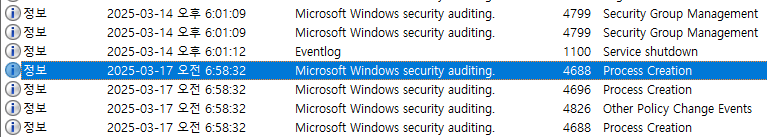
   - 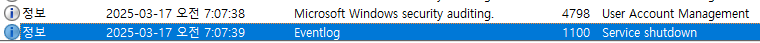

   - PC를 안끄고 다니면 ON/OFF 기록이 없을 것

3) 업무 시간 외 USB 연결 이력이 있는지
   - `C:\Windows\System32\winevt\Logs\Microsoft-Windows-Partiton%4Diagnostic.evtx`
   - 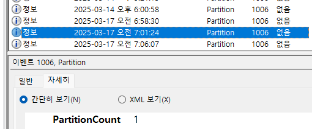
   - 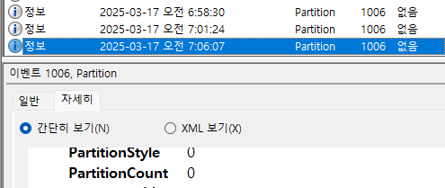
   - PartitionCount 1이면 연결 이력, 0이면 연결 해제 이력

   - Autopsy 의 USB Device Attached 에서 확인 가능.
     - Device ID : 윈도우가 인식하는 디바이스 번호
   - FTK Imager 로 볼륨 일련번호 확인 가능.
     - 포맷하면 일련번호가 변경 됨. 볼륨이 생성되면서 같이 생성되는 번호.

   - 포맷을 했다면 기록되어 있는 볼륨 시리얼 번호와 달라지지 않을까?
     - 링크파일, 점프리스트 분석해서 매칭

##### 파일/폴더 접근
4) 링크파일, 점프리스트를 통해 USB에서 파일을 접근한 이력 찾기
   - `%USERPROFILE%\AppData\Roaming\Microsoft\Windows\Recent` 추출
   - LNK Parser에서 접근이력 확인
   - 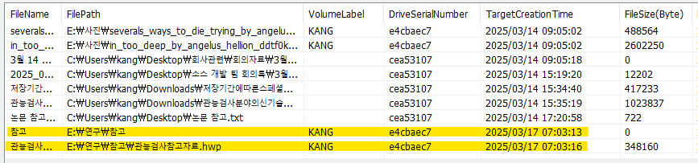
   - `%USERPROFILE%\AppData\Roaming\Microsoft\Windows\Recent\AutomaticDestination` 추출
   - JumpLister에서 접근이력 확인 / Jumplist Viewer(NirSoft)
   - 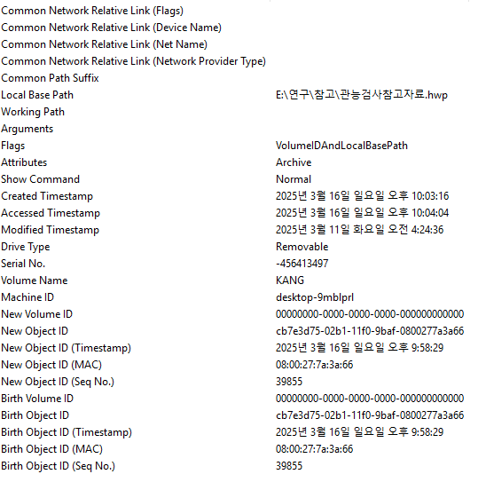
   - UTC 시간 기준. +9를 하면 시간이 맞는다.

5) ShellBag을 통해 용의자의 USB 폴더 접근을 확인
   - 레지스트리 추출
     - Users\[사용자이름]\ntuser.dat
     - Windows\System32\config\SAM, \SECURITY, \SYSTEM, \SOFTWARE
     - %USERPROFILE%\AppData\Roaming\Microsoft\Windows\usrClass.dat
   - REGA로 분석
   - HKEY_USERS\[보안식별자]\Software\Classes\Local Settings\Software\Microsoft\Windows\Shell\BagMRU\
   - ShellBag Explorer 에서 시간확인
     - 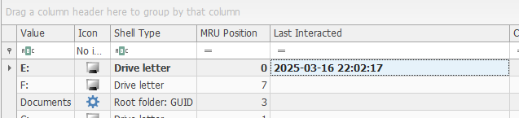

   - ShellBag 에서는 폴더구조를 확인할 수 있다.

##### 파일시스템
6) 찾은 파일을 복구한 후, 해당 파일에 어떤 데이터가 포함되어 있는지 확인
   - $Recycle.Bin 에서 복구. 날짜,시간 기준으로 확인
   - pdf 확장자를 hwp로 변경
   - 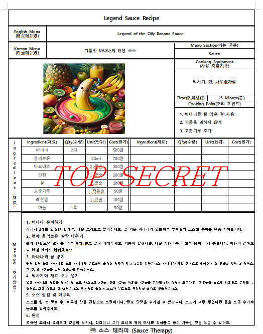
   - 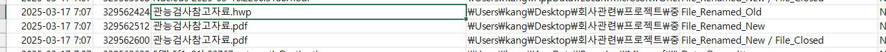
  
7) $UsnJrnl 분석을 통해 6)에서 찾은 파일이 휴지통으로 이동한 이력 있는지 확인
   - root-extend-$usnjrnl
   - NTFS Log Tracker
   - 분석내용 CSV 내보내기
   - 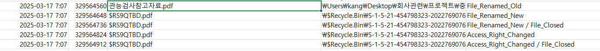

8) $UsnJrnl 분석을 통해 6)에서 찾은 파일의 확장자가 변경되었는지 확인
   - hwp -> pdf 로 변경되었다.
   - 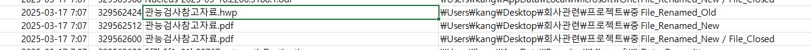

9)  강_USB.E01의 케이스 생성 후 $LogFile 확인
    - 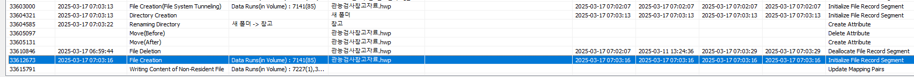

##### 프린터
10) 용의자가 레시피 파일을 출력한 흔적
    - C:\Windows\System32\spool\PRINTERS\
  
    - SHD: 프린터 작업 정보
    - SPL: 인쇄물 데이터
    - 저장 방식 2가지: RAW / EMF

11) Spool파일의 데이터 형식이 RAW인지 EMF인지
    - EMF
    - SPL 파일 확인
    - 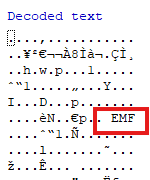

12) 레시피 파일을 출력한 것이 맞는지
    - 맞다. 
    - 헤더 떼어내고 EMF 파일로 보면 무엇인지 알 수 있음
    - 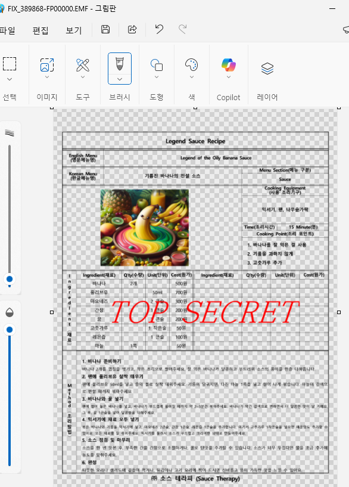

##### 해시 비교
13) 해시셋을 이용해 USB에 있는 레시피 파일과 해시 값이 일치하는지 확인
    - 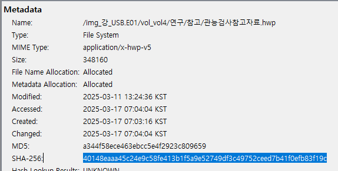
    - 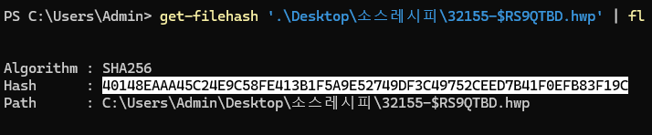

#### 영업비밀 유출 사건
- NeonForge 회사
- 기획운영팀 이다혜는 2020년 3월 입사, 2025년 2월 7일 퇴사, 경쟁업체 이직
- 영업비밀: 'Project Eclipse', 'Mecha War'
- 이미지 파일: NeonForge_LDH.E01
*참고: 웹 메일 사용 금지, 원격 프로그램 사용 금지.
25년 2월 7일은 새로운 PC를 보급한 날.
공유 드라이브 'NeonForge'로의 접근을 소속 별로 제한.
9시 출근 12~14시 업무, 15:30 퇴근, 16:09 사본획득

1) 운영체제
   - HKLM\SOFTWARE\Microsoft\Windows NT\CurrentVersion
   - win 10인지 win 11인지 구분하는 법
     - Software\Microsoft\BuildLab
   - `Windows 11 26100.1`

2) 사용자 계정
   - C:\Users 하위 확인
   - `201344`

3) 시스템 ON/OFF
   - C:\Windows\System32\winvt\Logs\Security.evtx  ---> 아님!!!!!
   - C:\Windows\System32\winvt\Logs\System.evtx 
   - 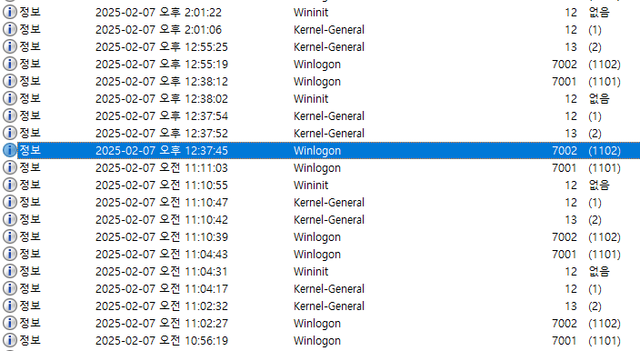

4) 설치 프로그램 정보
   - HKEY_LOCAL_MACHINE\Software\Microsoft\Windows\CurrentVersion\Uninstall
   - HKEY_CURRENT_USER\Software\Microsoft\Windows\CurrentVersion\Uninstall
   - 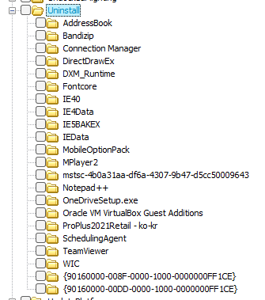
   - 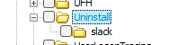
   - mstsc -> 원격 프로그램
   - TeamViewer -> 원격프로그램
   - 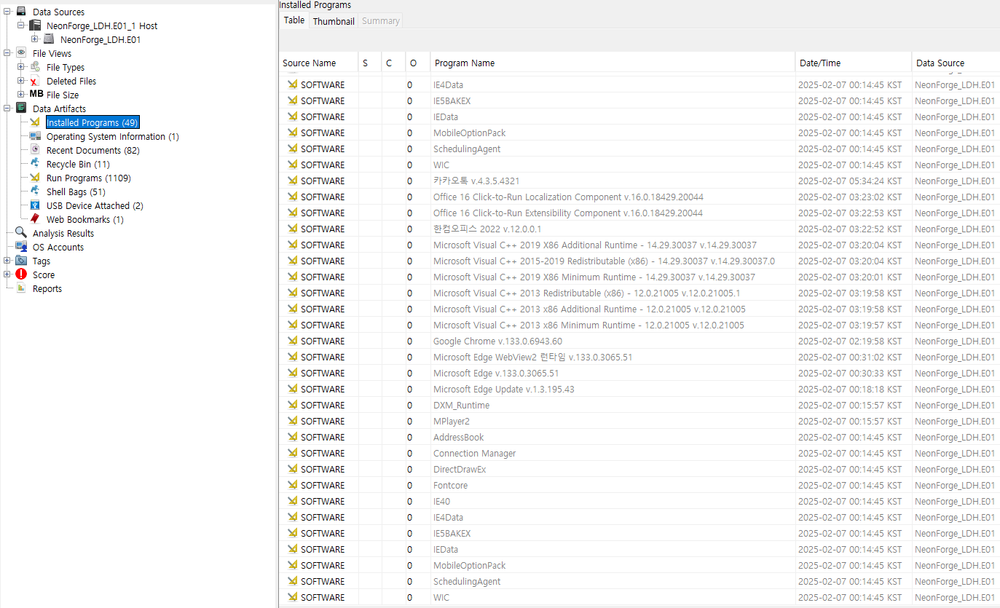

5) 실행 프로그램 정보
   - %SystemRoot%\Prefetchs
   - 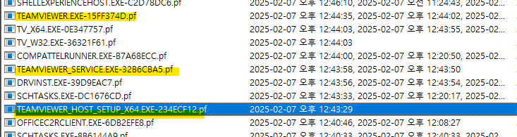
   - 팀뷰어 설치 후 실행

> [!warning] Autopsy 문제
> Autopsy 에서는 생성 시간이 변경되어서 추출되는 문제가 있다  
> 

6) Link 파일 정보
   - `%USERPROFILE%\AppData\Roaming\Microsoft\Windows\Recent` 
   - 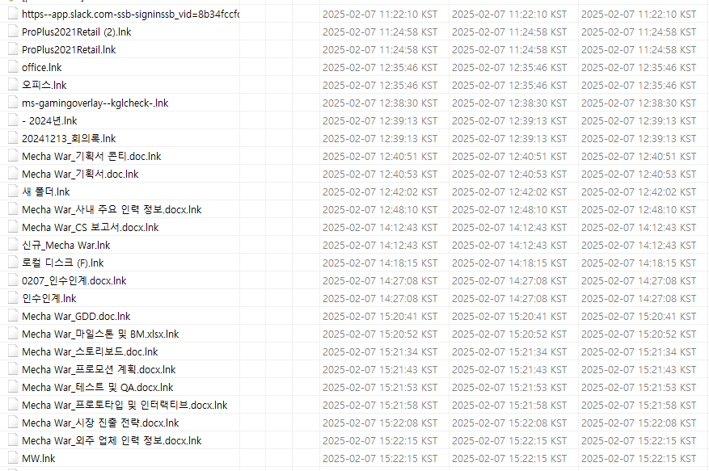

7) 점프리스트 확인
   - `%USERPROFILE%\AppData\Roaming\Microsoft\Windows\Recent\AutomaticDestination`
   - 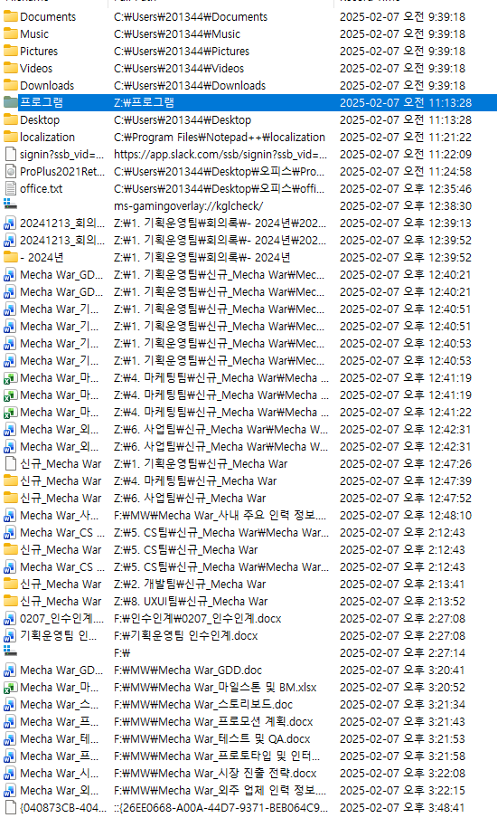

8) ShellBags MRU 정보 확인
   - 레지스트리 추출
     - Users\[사용자이름]\ntuser.dat
     - Windows\System32\config\SAM, \SECURITY, \SYSTEM, \SOFTWARE
     - %USERPROFILE%\AppData\Local\Microsoft\Windows\usrClass.dat
   - REGA로 분석
     - HKEY_USERS\[보안식별자]\Software\Classes\Local Settings\Software\Microsoft\Windows\Shell\BagMRU\
   - ShellBag Explorer 에서 시간확인
   - 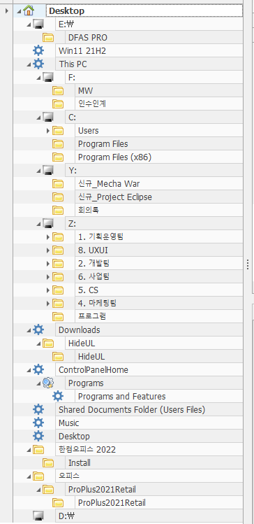

   - 네트워크 드라이브 장치는 알파벳 끝 부터 지정이 된다.

9)  웹 브라우저 관련 이력 확인
    - Users\[user name]\AppData\Google\Chrome\User Data\Default\History
    - BrowsingHistory View
    - 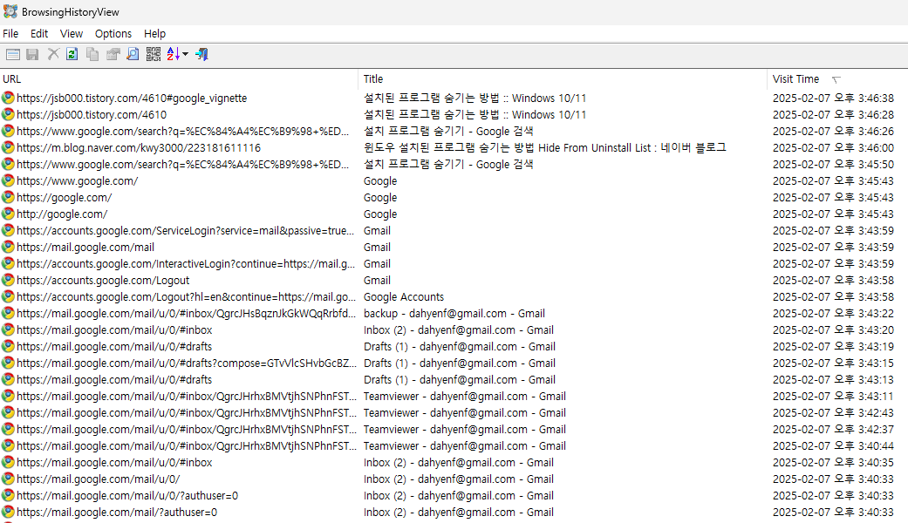

10) 탐색기 탭에서 시스템에 저장된 내용을 확인
    - 

11) 삭제된 파일 이력 확인
    - 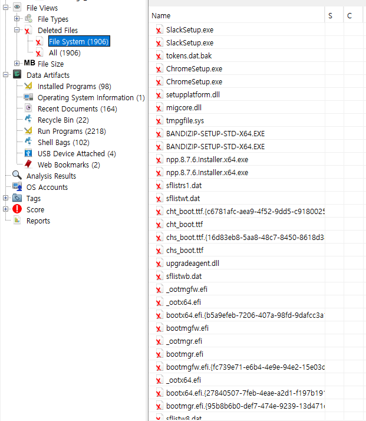

12) 원격 접속과 관련된 내용을 기록하는 파일 찾고, 파일 분석, 원격 접속 시작 및 종료 시간 확인

13) 기업에서 제출한 영업비밀과 사용자가 반출한 것으로 의심되는 파일이 동일한지 확인

사용자는 퇴근 시 전원 OFF 하지 않은 상태에서 메일을 보냄